<a href="mailto:atiwari73874@gmail.com">✉️ atiwari73874@gmail.com</a> ·
<a href="tel:+919682764940">📞 +91 96827 64940</a> ·
<a href="https://linkedin.com/in/abhishek-kumar-tiwari-b448b5328">💼 LinkedIn</a> ·
<a href="https://github.com/blackshadowog">🐙 GitHub</a>

- 🎓 Pursuing **B.Tech, Computer Science & Engineering (AI/ML)** at IEC College of Engineering and Technology · Class of **2028**
- 💻 Currently interning as a **Data Analyst** at Axlero Innovative Solutions & NEXLEVR
- 🏗️ Building **MetricMind**, an agentic semantic BI engine (dbt · Cube.dev · LangGraph)
- 🤝 Open to collaborating on **Data Analytics, Dashboards & ML projects**
- 📫 Reach me at **atiwari73874@gmail.com**
- ⚡ Fun fact: I sketch my dashboards before I build them — hence the "notebook" theme 📓

---

### // most recent first — Experience log

**Data Analyst Intern** · Axlero Innovative Solutions · Remote — 🟢 *currently working*
`Jul 2026 — Oct 2026`
Analyzing, cleaning, and interpreting data for the Data Analytics & Business Intelligence team; writing and optimizing SQL queries; building reports and dashboards.

**Data Analyst Intern** · NEXLEVR · Remote — 🟢 *currently working*
`Jul 2026 — Aug 2026`
Working on real-world data analyst tasks and reporting, contributing to the team's data initiatives.

**Artificial Intelligence Trainee** · YuvaIntern · Remote
`Jun 2026`
Completed the AI Trainee internship program in partnership with NSDC. Certificate issued Jun 21, 2026.

**Data Analyst Intern** · VirtualWorks by Emogi · Remote — 🏅 *Grade A, 95/100*
`May 2026 — Jun 2026`

**Web Development Intern** · InAmigos Foundation · Remote
`May 2026 — Jun 2026`
Built responsive web apps with HTML5, CSS3, and JavaScript, using Git/GitHub for version control.

---

### // things I built to learn by doing — Projects

| Project | What it does | Stack | Link |
|---|---|---|---|
| **MetricMind** | Agentic semantic BI engine — an AI agent answers business questions by emitting semantic `cube_query` calls (never raw SQL), backed by a full dbt transformation layer and a 15-cube semantic model | dbt · Cube.dev · LangGraph · Next.js · DuckDB | [GitHub ↗](https://github.com/blackshadowog) |
| **RentMyThing** | Peer-to-peer campus rental marketplace pitch for Indian college campuses, with AI fraud detection and a live demo; built with Team BlackTech for ThinkForBharat 1.0 | Gemini API · pptxgenjs · Product Design | [GitHub ↗](https://github.com/blackshadowog) |
| **Database Design for an E-Commerce Store** | Fully normalized relational schema for products, customers, orders, and payments | MySQL · ER Diagram · Normalization | [GitHub ↗](https://github.com/blackshadowog/Database-Design-for-an-E-commerce-Store-MySQL-) |
| **Inventory Management System** | Relational database tracking inventory, suppliers, stock, and orders with CRUD + aggregate queries | MySQL Workbench · CRUD | [GitHub ↗](https://github.com/blackshadowog/Inventory-Management-System) |
| **Blacksort Pro X** | File management app that auto-sorts and categorizes files | Python · Automation | [Live Demo ↗](https://blacksort-pro-x.vercel.app/) |
| **Space Dodge — Arcade Survival Game** | Browser-based 2D survival game with real-time collision detection & score tracking | Python · Pygame · Flask | [Play on itch.io ↗](https://unisphere.itch.io/space-dodge-arcade-survival) |
| **Predictive Analytics Using Historical Data** | Forecasting model mining historical data for trends & seasonality | Python · Pandas · Forecasting | [GitHub ↗](https://github.com/blackshadowog/Predictive-Analytics-Using-Historical-Data) |
| **Customer Segmentation Project** | Clustering customers by behavior & demographics into targetable groups | Python · Clustering · EDA | [GitHub ↗](https://github.com/blackshadowog/Customer-Segmentation-Project) |
| **Sales Revenue Analysis Dashboard** | Interactive dashboard breaking down revenue by product, region, and time | Power BI · SQL · Dashboarding | [GitHub ↗](https://github.com/blackshadowog/Sales-Revenue-Analysis-Dashboard-internship-project---thiranex) |
| **Virtual Lab Intern Project** | Virtual lab simulation for running experiments interactively | JavaScript · Simulation | [GitHub ↗](https://github.com/blackshadowog/virtual-lab-intern) |
| **YuvaIntern AI Trainee Projects** | Collection of AI trainee assignments spanning core ML & applied AI | Python · Machine Learning | [GitHub ↗](https://github.com/blackshadowog/yuva-intern-projects-Artificial-intelligence-AI-trainee-) |
| **Digital Civic Portal** — Smart India Hackathon | Built with teammate Prateek Vijay — citizens report civic issues with photos + location; officers get a tracking dashboard | SIH · Full-Stack · Team Project | [Live Site ↗](https://digitalcivicportal.netlify.app/) |
| **Code Craft** | Browser-based coding playground for writing & running code snippets | JavaScript · Web App | [Live Site ↗](https://code-craft-gbgy.vercel.app/) |

> 📝 Update the MetricMind and RentMyThing links above once those repos are public.

---

### // what's in the toolbox — Skill sketch

**Languages:** Python · SQL · JavaScript

**Analytics & BI:** EDA & data cleaning · Statistical analysis · Time-series & demand forecasting · Business reporting

**Visualization:** Power BI · Tableau · Excel · Matplotlib

**Databases:** MySQL / MySQL Workbench · Joins, subqueries, views · Indexing & normalization

**Cloud & platforms:** Microsoft Azure AI · Google Cloud Skills Boost · AWS · Generative AI & prompt engineering

**Core concepts:** OOP & DSA · API integration · Dashboard development · DBMS

---

### Socials

&nbsp;&nbsp;
&nbsp;&nbsp;

---

### Certificates — pinned to the board

<b>Internship Certificates</b>

 

- Data Analyst Internship — VirtualWorks by Emogi *(Grade A, 95/100)*
- Web Development Internship — InAmigos Foundation
- Artificial Intelligence Trainee Internship — YuvaIntern · NSDC

<b>Professional Job Simulations</b>

 

- Data Analytics Job Simulation — Deloitte, via Forage
- GenAI Job Simulation — BCG X, via Forage
- Quantitative Research Job Simulation — JPMorgan Chase & Co., via Forage

<b>Technical & Cloud Certifications</b>

 

- Foundations of Prompt Engineering — AWS Training & Certification
- Call Center Analytics with Amazon Nova — AWS Training & Certification
- What Is Generative AI? — LinkedIn Learning
- Data Science 101 — IBM SkillsBuild
- SQL and Relational Databases 101 — IBM SkillsBuild
- Introduction to Data Analytics — Great Learning
- Introduction to MS Excel — Great Learning
- Power BI for Beginners — Great Learning
- SQL for Data Science — Great Learning
- SQL for Data Analysis — Great Learning
- SQL (Basic) — HackerRank

<b>Participation & Achievements</b>

 

- GfG IEC DSA Workshop — GeeksforGeeks Student Chapter, via Unstop
- The Techclasher Hackathon — GNIOT Engineering College, Team UniSphere
- TRIQ — Think Twice — OutThinkX
- 100K Milestone Honor — CampusCrew

---

### Education

**B.Tech, Computer Science & Engineering** — SGPA: 7.5
AI/ML Specialization · IEC College of Engineering and Technology, Greater Noida · Sep 2024 – Present

**12th, U.P. Board**
S.V.M.I.C, Gonda, UP · 2023 – 2024

---

### // live from GitHub

  
  

  

<!--
🐍 Want an animated snake eating your contribution graph (like the one on many GitHub profiles)?
1. In this repo, create `.github/workflows/snake.yml` using the official action:
   https://github.com/Platane/snk — it generates a `github-contribution-grid-snake.svg`
2. Embed it here with:
   
Ask me anytime and I'll write the exact workflow file for you.
-->

---

<i>Have data that needs a story? Let's talk.</i>

<a href="mailto:atiwari73874@gmail.com">atiwari73874@gmail.com</a> ·
<a href="tel:+919682764940">+91 96827 64940</a> ·
<a href="https://linkedin.com/in/abhishek-kumar-tiwari-b448b5328">LinkedIn</a> ·
<a href="https://github.com/blackshadowog">GitHub</a>

